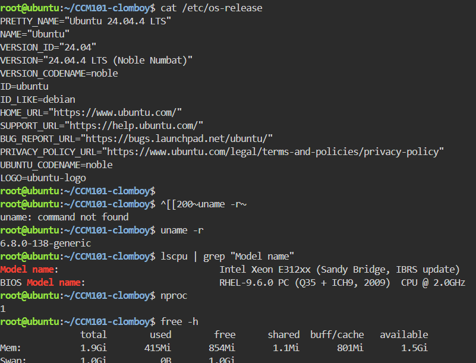
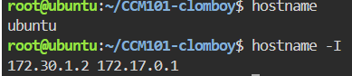
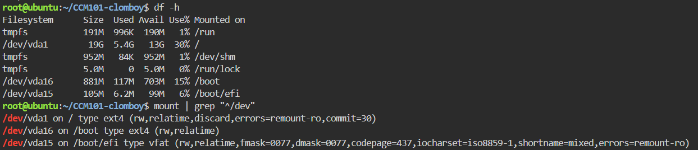

# Infrastructure Report

## Operating System
- **OS:** Ubuntu 24.04.4 LTS (Noble Numbat)
- **Kernel Version:** 6.8.0-138-generic

## Compute
- **CPU Model:** Intel Xeon E312xx (Sandy Bridge, IBRS update)
- **CPU Cores:** 1
- **Total RAM:** 1.9 GiB total (415 MiB used, 854 MiB free, 801 MiB buff/cache, 1.5 GiB available)
- **Swap:** 1.0 GiB (0B used)

## Storage
- **Disk Capacity:**
  | Filesystem | Size | Used | Avail | Use% | Mounted on |
  |---|---|---|---|---|---|
  | tmpfs | 191M | 996K | 190M | 1% | /run |
  | /dev/vda1 | 19G | 5.4G | 13G | 30% | / |
  | tmpfs | 952M | 84K | 952M | 1% | /dev/shm |
  | tmpfs | 5.0M | 0 | 5.0M | 0% | /run/lock |
  | /dev/vda16 | 881M | 117M | 703M | 15% | /boot |
  | /dev/vda15 | 105M | 6.2M | 99M | 6% | /boot/efi |

- **Mounted File Systems:**
  - `/dev/vda1` on `/` — type ext4 (rw,relatime,discard,errors=remount-ro,commit=30)
  - `/dev/vda16` on `/boot` — type ext4 (rw,relatime)
  - `/dev/vda15` on `/boot/efi` — type vfat (rw,relatime,fmask=0077,dmask=0077)

## Networking
- **Hostname:** ubuntu
- **IP Address:** 172.30.1.2 (primary), 172.17.0.1 (secondary/docker bridge)

## Screenshots

