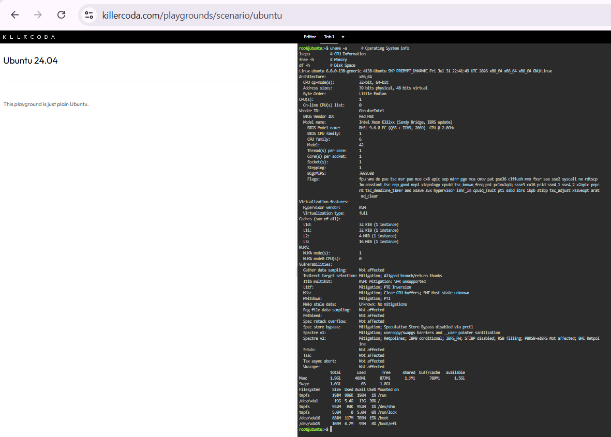

# Laboratory 03 - Multi-Cloud Explorer

CCM101 Cloud Computing - Multi-Cloud Explorer mission for CloudNova Technologies.

## Checkpoint 7 – Continue Your Linux Investigation

### System Information (via KillerCoda Playground - Ubuntu 24.04)

**Operating System**
- Ubuntu 24.04
- Kernel: Linux 6.8.0-138-generic (x86_64)

**CPU Information**
- Architecture: x86_64
- Vendor: GenuineIntel
- Model: Intel Xeon E312xx (Sandy Bridge, IBRS update)
- CPU(s): 1
- Core(s) per socket: 1
- Thread(s) per core: 1

**Memory**
- Total: 1.5Gi
- Used: 414Mi
- Free: 1.0Gi

**Disk Space**
- Filesystem: /dev/vda1
- Size: 952M
- Used: 84M
- Available: 837M
- Use%: 1%

**Terminal Output Screenshot**

### Cloud Migration Analysis

If this Linux server were migrated to the cloud, it would be considered a lightweight, single-core workload with low memory and minimal disk usage. It could be hosted using the following services:

| Provider | Service | Notes |
|---|---|---|
| **AWS** | Amazon EC2 (t2.micro / t3.micro) | Matches low CPU/RAM specs; free-tier eligible |
| **Microsoft Azure** | Azure Virtual Machines (B-series, e.g. B1s) | Burstable, cost-efficient VM for light workloads |
| **Google Cloud Platform** | Compute Engine (e2-micro) | Free-tier eligible, similar low-resource VM |

Given the low disk usage (~84MB), a small standard SSD tier such as AWS EBS gp3, Azure Standard SSD, or GCP Persistent Disk would be more than sufficient to host this server in the cloud.
